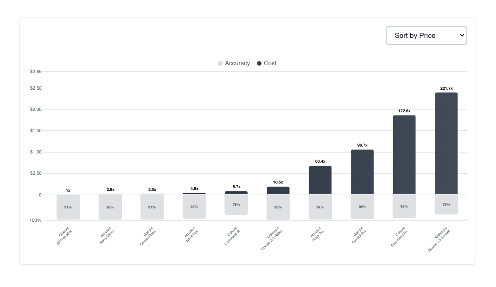

# AI Data Extraction Leaderboard



[View Full Leaderboard →](https://coffeeblack.ai/extractor-leaderboard/index.html)

The AI Data Extraction Leaderboard evaluates how well different AI models handle real-world data extraction tasks commonly encountered by AI agents. Through rigorous testing and analysis, we benchmark leading AI models across key performance metrics:

- Extraction accuracy and reliability
- Response latency and throughput 
- Cost efficiency and token usage
- Handling of complex data structures
- Robustness across different data formats


## Overview

This framework provides a standardized way to:
- Test different LLM models (GPT, Cohere, Gemini, etc.) on web data extraction tasks
- Compare extraction accuracy and performance across models
- Evaluate extraction capabilities across varying levels of complexity

## Difficulty Classifications

### Easy:
- Simple, flat HTML structure
- Clear, consistent formatting
- Direct mapping of data to schema
- Single destination
- No nested elements
- Standard data formats

### Medium:
- Nested HTML structure
- Mixed content presentation
- Features in list format
- Regional grouping
- Multiple destinations
- Consistent but varied formatting

### Hard:
- Complex nested structures
- Dynamic content
- Multiple data points
- Different data formats
- Conditional date ranges
- Nested feature lists with attributes
- Mixed content types
- Irregular patterns
- Data requiring aggregation/transformation

## Extraction Categories

The framework evaluates extraction capabilities across several categories:

- **Structural Extraction**: Tables, navigation menus, lists
- **Metadata Extraction**: Meta tags, site settings, SEO data
- **Media Extraction**: Images, videos, encoded media
- **Semantic Extraction**: Article text, comments, profiles
- **Analytics Extraction**: Metrics, statistics, aggregations

## Usage

1. Add test cases to dataset/input/
2. Define expected outputs in test templates
3. Configure model settings in ModelConfig
4. Run tests and compare results

## Rate Limiting

Models have configurable rate limits to prevent API overuse:
- Token limits per minute
- Request spacing
- Context window restrictions

## Contributing

When adding new test cases, please:
1. Classify difficulty level appropriately
2. Include sample input HTML
3. Define expected output schema
4. Tag with relevant extraction categories

## Installation & Setup

1. Clone the repository:
   ```bash
   git clone https://github.com/yourusername/web-extraction-framework.git
   cd web-extraction-framework
   ```

2. Create a virtual environment:
   ```bash
   python -m venv venv
   source venv/bin/activate  # On Windows use `venv\Scripts\activate`
   ```

3. Install the dependencies:
   ```bash
   pip install -r requirements.txt
   ```

4. Set up environment variables:
   - Create a `.env` file in the root directory.
   - Add necessary environment variables as per your configuration.


## Running Model Comparisons

The `compare_models.py` script allows you to evaluate and compare different models on predefined test cases. Below are the steps to run the script:

1. **Navigate to the project directory**:
   Ensure you are in the root directory of the project where `compare_models.py` is located.

2. **Run the script**:
   Use the following command to execute the script:

   ```bash
   python compare_models.py --test-suite <suite> --model <model> --output <mode>
   ```

   - `--test-suite`: Specify the test suite to run. Options are `all`, `easy`, `medium`, `hard`. Default is `all`.
   - `--model`: Specify the model or family to run. Options include `all`, specific model names, or model families. Default is `all`.
   - `--output`: Specify the output mode. Options are `cli` for command-line output or `file` to save results to a JSON file. Default is `cli`.

3. **Example Usage**:
   To run all models on the medium difficulty test suite and output results to the command line, use:

   ```bash
   python compare_models.py --test-suite medium --model all --output cli
   ```

4. **View Results**:
   - If `--output cli` is used, results will be displayed in the terminal.
   - If `--output file` is used, results will be saved to `model_comparison_results.json` in the project directory.

## Support

For support, please contact the maintainers at [https://coffeeblack.ai/contact/index.html](https://coffeeblack.ai/contact/index.html) or open an issue on the [GitHub repository](https://github.com/yourusername/web-extraction-framework/issues).


## Model Configurations

The framework supports various models with different configurations. Below is a summary of the models and their specifications:

- **Azure OpenAI Models**
  - **gpt-4o-mini**
    - Context Window: 128,000 tokens
    - Pricing: $0.015 per input token, $0.60 per output token
    - Rate Limit: 60,000 tokens per minute, 500 requests per minute

- **Google Models**
  - **gemini-1.5-pro**
    - Context Window: 128,000 tokens
    - Pricing: $1.25 per input token, $5.00 per output token
    - Rate Limit: 128,000 tokens per minute, 60 requests per minute
  - **gemini-1.5-flash-002**
    - Context Window: 1,000,000 tokens
    - Pricing: $0.0375 per input token, $0.15 per output token
    - Rate Limit: 100,000 tokens per minute, 60 requests per minute

- **Amazon Bedrock Models**
  - **amazon.nova-micro-v1:0**
    - Context Window: 128,000 tokens
    - Pricing: $0.035 per input token, $0.14 per output token
    - Rate Limit: 50,000 tokens per minute, 100 requests per minute
  - **amazon.nova-lite-v1:0**
    - Context Window: 300,000 tokens
    - Pricing: $0.06 per input token, $0.24 per output token
    - Rate Limit: 50,000 tokens per minute, 100 requests per minute
  - **amazon.nova-pro-v1:0**
    - Context Window: 300,000 tokens
    - Pricing: $0.8 per input token, $3.2 per output token
    - Rate Limit: 50,000 tokens per minute, 100 requests per minute

- **Groq Models**
  - **llama-3.1-8b-instant**
    - Context Window: 128,000 tokens
    - Pricing: $0.05 per input token, $0.08 per output token
    - Rate Limit: 20,000 tokens per minute, 30 requests per minute

- **Cohere Models**
  - **command-r-plus**
    - Context Window: 128,000 tokens
    - Pricing: $2.50 per input token, $10.00 per output token
    - Rate Limit: 128,000 tokens per minute, 10 requests per minute

